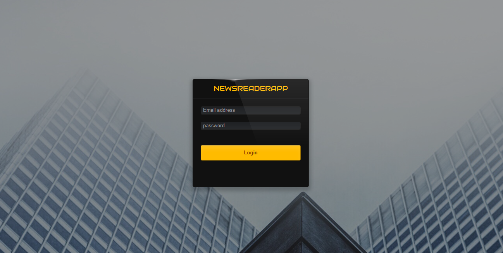

# newsminutes
News Aggregator App is a Web Application Aggregates News articles from multiple websites

# Packages

- requests
- BeautifulSoup
- Bootstrap3

# Install  packages with pip: 
pip install -r requirements.txt

## How to run this app

(The following instructions apply to Posix/bash. Windows users should check
[here](https://docs.python.org/3/library/venv.html).)

First, clone this repository and open a terminal inside the root folder.

Create and activate a new virtual environment (recommended) by running
the following:

```bash
python3 -m venv myvenv
source myvenv/bin/activate
```

Install the requirements:

```bash
pip install -r requirements.txt
```
Run the app:

```bash
python3 manage.py runserver
```
Open a browser at http://127.0.0.1:8080

# Screenshot




